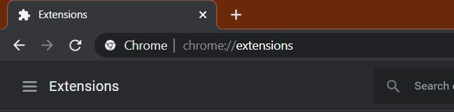
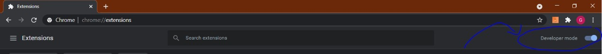
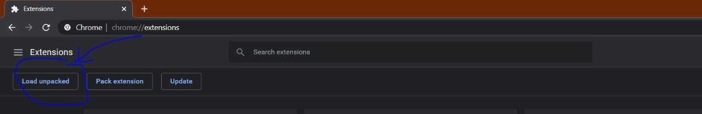
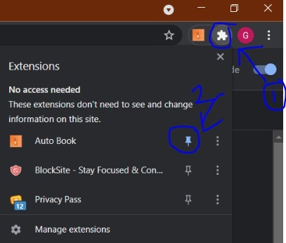

What the extension does and doesn't:

Automatically clicks if vaccine slot is available. Doesn't automate the human related steps like entering OTP, captcha.

**Instructions to install** 👇

1) Download zip and extract
2) Open chrome and type chrome://extensions in URL
3) Tick Developer mode on the right
4) Click Load unpacked and select the "code" folder which has the extracted files (keep them in a folder) 
5) Done :)

**Tips/instructions to run** 👇

1) Click extension on right and pin the extension for ease of use      
 
3) You need to enter these details (state, district) and then click on the Charmander on the right to auto search
4) If it logs out then you need to login manually and refresh the page or click on URL and enter if it’s not auto searching

Happy vaccine booking🤣
